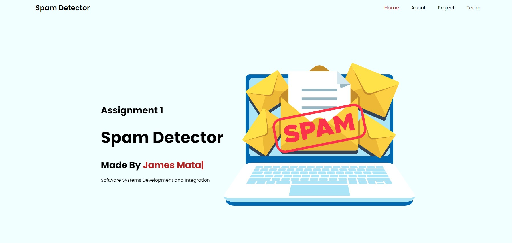
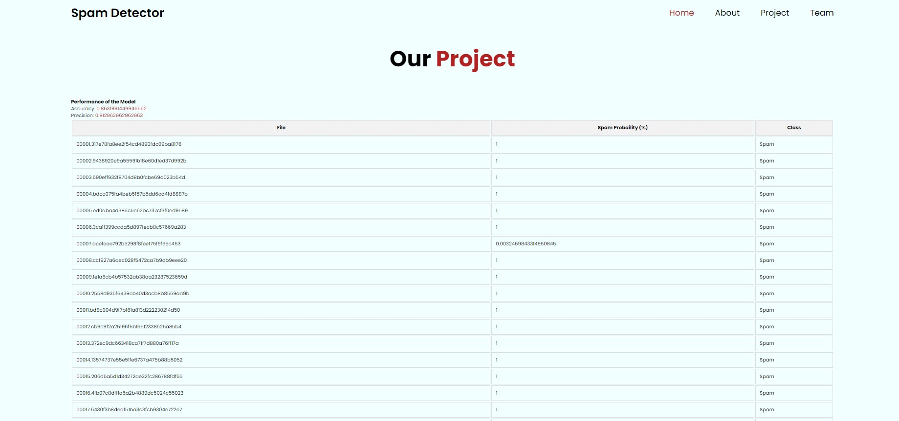

Hello and welcome to our project

Tired of all the annoying advertisements in your inbox, We have resolved to create a program that can filter out spam emails. Our spam detector uses a unigram approach to analyze each word in an email and determine whether or not it is spam. The program calculates probabilities based on each word's frequency, allowing it to distinguish between spam and legitimate emails with high accuracy. To train the system, We have used a dataset of emails (spam and non-spam) and have written the SpamDetector class to read, test, and train the model. With many samples to use, my program is well-equipped to filter out unwanted messages and improve my overall email experience. Our algorithm is 86% accurate and 81% precise so you know 8 times out of 10 our algorithm has got your back

This project was a collaborative effort made by James Mata, Mirisan Ravindran, and Harsh panchal

### Improvements

Spam Detection Algorithm

For our spam detection algorithm we noticed that alot of words within an email are markdown nonsense that dont contribute at all to spam detection but do slow down the operation. To combat this we included a full english dictionary that loads into a hashset to stay efficent. This was we can check whether or not a word is nonsense or not before we add it to our probability maps this speeds up computation by a significant margin and even provides more accurate detection

HTML

The HTML code represents a webpage for a spam detector project. The code includes various sections such as the header, home section, about section, project section, team section, and footer. The header section contains a logo and a navigation menu with links to different sections of the page. The home section includes a title, a brief introduction, and an image. The about section describes the project and how it works. The project section displays a table of data related to the performance of the spam detector model, including accuracy and precision measures. The team section provides information about the team members who worked on the project. Lastly, the footer section includes the course code and a button that takes users back to the top of the page.

CSS

The CSS code included in this project is designed to provide a modern and responsive visual experience for the website. In addition to these defaults, we have added our own custom styles to define the look and feel of the website. These custom styles use the popular 'Poppins' font and define variables for colors that are used consistently throughout the website. The CSS also includes classes for the header, navbar, home, about, and project sections, which provide a consistent layout and styling across the website. Overall, the CSS code is well-organized and easy to read, making it easy to customize and build upon for future projects.

Javascript

The JavaScript code is responsible for the functionality of the webpage. The first function toggles the navbar icon and displays the navbar when clicked. The second function highlights the active section in the navbar when scrolling. The code also includes a sticky navbar that appears when scrolling past a certain point on the page. Additionally, the code uses ScrollReveal to animate certain elements on the page. Finally, the code displays performance accuracy and precision data fetched from a server using fetch API and displays it on the webpage using JavaScript

### How To Run

Running this program is very simple if the nessesary environment is already setup with a glassfish server on stand-by. Since no hard coding is done and all directories are based on the repo simply cloneing the repo should set everything up. From there its as easy as running the glassfish server and opening the index.html file and your good to go.
